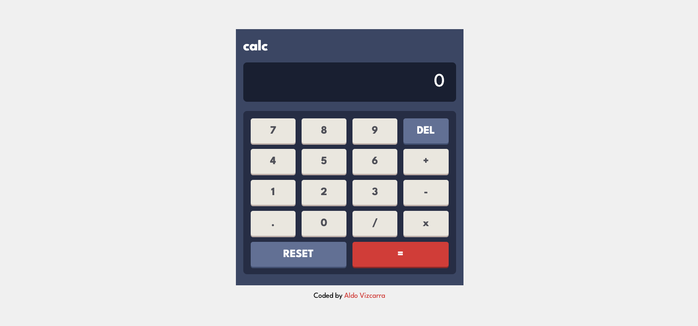

# Calculator

## Table of contents

- [Overview](#overview)
  - [Screenshot](#screenshot)
  - [Links](#links)
- [My process](#my-process)
  - [Built with](#built-with)
  - [Author](#author)

## Overview

### Screenshot

### Links

- Solution URL: [Github](https://github.com/aldovizcarra/calculator)
- Live Site URL: [Live Site](https://aldovizcarra.github.io/calculator/)

## My process

### Built with

- HTML5 Markup
- CSS
- CSS Grid
- Vanilla Javascript

## Author

- Website - [Aldo Vizcarra](https://github.com/aldovizcarra)
- Frontend Mentor - [@aldovizcarra](https://www.frontendmentor.io/profile/aldovizcarra)
